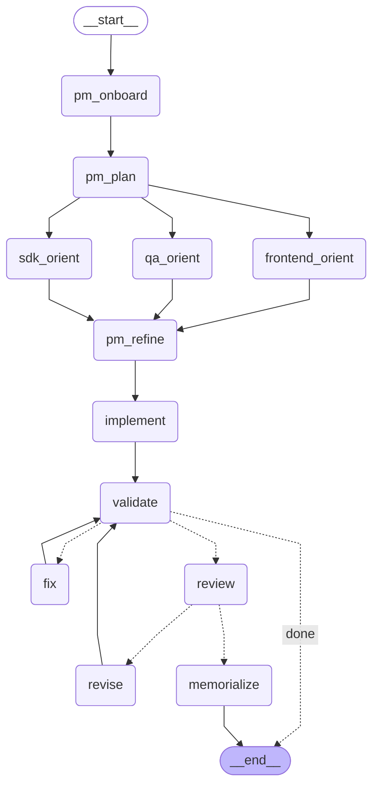

# 🐙 PoshDash

A transparent always-on-top overlay for [iRacing](https://www.iracing.com/) that displays real-time telemetry — RPM rev lights, incident count, brake bias, traction control, and ABS — directly on your screen while you race.

## Personal Project

This is a tool I created for my own use. I'm not building it as a product or planning large-scale development — just something I wanted to address for myself. Specifically, I built this because when your FOV is set correctly in many cars, you often can't see the dashboard, and I felt that rev lights were something I was missing. If you enjoy it, you're welcome to use it, but you should expect this to remain a relatively simple, focused project.

## Features

- **Per-car LED rev lights** — circular LEDs with colors, count, and growth pattern sourced from [Lovely Sim Racing car data](https://github.com/Lovely-Sim-Racing/lovely-car-data) for 67+ iRacing cars
- **Accurate shift indicators** — LEDs follow each car's real shift light pattern (sequential, symmetrical, outside-in) with per-gear RPM thresholds
- **Redline flash** — all LEDs rapidly blink the car's redline color when it's time to shift (suppressed in top gear)
- **Smart visibility** — cars without LED profiles show only the telemetry ribbon, no fake generic lights
- **Live telemetry ribbon** — RPM counter left, incidents/BB/TC/ABS right — settings hidden when the car doesn't support them
- **Fuel laps remaining** — colored dot (green/yellow/red) with laps of fuel left, based on current fuel level and consumption rate
- **Scalable UI** — text and LEDs scale proportionally when you resize the overlay
- **Transparent overlay** — click-through when locked, draggable/resizable when unlocked
- **Position memory** — overlay position and size persist across restarts
- **Auto-update** — silently downloads new versions from GitHub Releases and prompts to restart
- **System tray** — show/hide, lock/unlock, check for updates, exit

## Install

Download the latest installer from [Releases](https://github.com/sdcarter/posh-overlay/releases). Run the `.exe` — PoshDash installs and launches automatically.

Updates are delivered automatically. When a new version is ready, you'll be prompted to restart.

## Usage

1. Launch PoshDash — it appears as an octopus icon in your system tray
2. Start iRacing — telemetry connects automatically
3. Right-click the tray icon to unlock the overlay, drag it where you want, then lock it back

The overlay is invisible to screen capture tools and stays on top of fullscreen applications.

## Development

```bash
# Install dependencies
npm install

# Run default mock scenario
npm run mock

# Run specific mock scenarios
npm run mock:mazda
npm run mock:bmw
npm run mock:sfl
npm run mock:finish

# Run fuel indicator scenario
npm run mock:fuel

# Lint
npm run lint

# Build
npm run build

# Package (local .exe, no publish)
npm run pack
```

Requires Node.js 22+ and npm. The iRacing telemetry adapter (`irsdk-node`) only compiles on Windows — on macOS/Linux, the app runs with mock telemetry.

Mock scenarios are launched through npm targets. Under the hood they set `POSHDASH_USE_MOCK=true` and `POSHDASH_MOCK_SCENARIO=<name>` before starting the Electron app.

## Architecture

PoshDash uses a hexagonal (ports-and-adapters) architecture:

```text
domain/        Pure TypeScript — telemetry types, rev-strip evaluation, ribbon formatting
application/   Use cases and port interfaces
adapters/      iRacing SDK, mock telemetry, GitHub release feed
main/          Electron main process + preload
renderer/      React UI (Overlay, RevStrip)
```

## Agent Workflow

PoshDash includes a LangGraph-based multi-agent workflow for AI-assisted development. Write a feature request in `request.md` and run `uv run agents --file request.md`.



| Node | Role | What it does |
|------|------|-------------|
| pm_onboard | Product Manager | Summarizes the request |
| pm_plan | Product Manager | Creates session plan with acceptance criteria |
| sdk_orient | SDK Architect | Reads domain/application code, recommends types and files |
| frontend_orient | Frontend Architect | Reads renderer code, identifies exact lines to change |
| qa_orient | QA Agent | Checks build config, flags risks |
| pm_refine | Product Manager | Synthesizes orient reports into a single implementation brief |
| implement | Developer | Reads files, makes surgical edits via patch_file |
| validate | Build check | Runs tsc + eslint locally (no LLM) |
| fix | Developer | Reads errors, patches files to fix build |
| review | PO Acceptance | Reads changed files, verifies request was fully met |
| revise | Developer | Addresses review feedback |
| memorialize | Product Manager | Saves or amends feature spec in memory |

Requires Python 3.12+ and [uv](https://docs.astral.sh/uv/). Azure OpenAI key in `.env` as `AZURE_OPENAI_API_KEY`.

## Acknowledgements

- [Lovely Sim Racing](https://github.com/Lovely-Sim-Racing/lovely-car-data) — open car data project providing LED profiles, colors, and per-gear RPM thresholds for 67+ cars. A collaboration between Lovely Sim Racing, [ATSR](https://atsr.net/), and [Gomez Sim Industries](https://www.gomezsimind.com/).
- [irsdk-node](https://github.com/nicordev/irsdk-node) — Node.js bindings for the iRacing SDK
- [iRacing](https://www.iracing.com/) — the sim racing platform

## License

MIT
