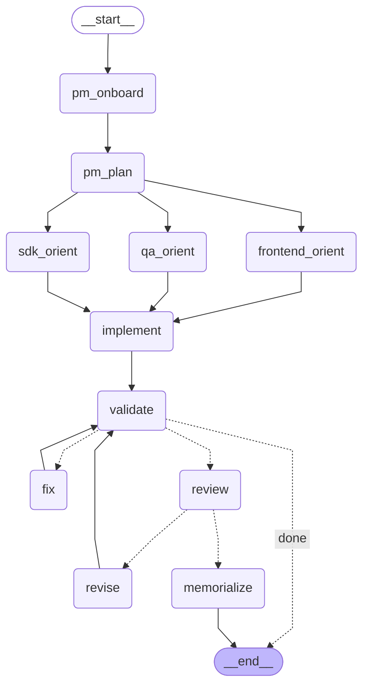

# Agent Workflow

## Node Descriptions

| Node | Role | What it does |
|------|------|-------------|
| pm_onboard | Product Manager | Summarizes the request |
| pm_plan | Product Manager | Creates session plan with acceptance criteria |
| sdk_orient | SDK Architect | Reads domain/application code, recommends types and files |
| frontend_orient | Frontend Architect | Reads renderer code, identifies exact lines to change |
| qa_orient | QA Agent | Checks build config, flags risks |
| implement | Developer (gpt-5-chat) | Reads files, makes surgical edits via patch_file |
| validate | Build check | Runs tsc + eslint locally (no LLM) |
| fix | Developer (gpt-5-chat) | Reads errors, patches files to fix build |
| review | PO Acceptance | Reads changed files, verifies request was fully met |
| revise | Developer (gpt-5-chat) | Addresses review feedback |
| memorialize | Product Manager | Saves or amends feature spec in memory |
